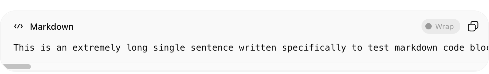
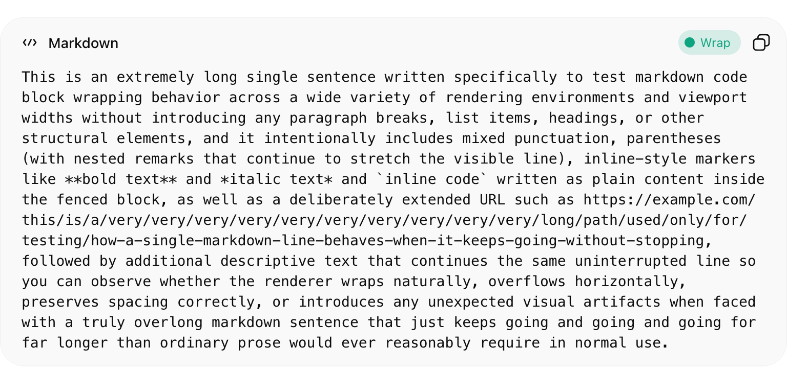

# ChatGPT Code Wrap Toggle

A browser extension for Chrome, Edge, and Firefox that adds a **per-block word wrap toggle** to ChatGPT code blocks. No more horizontal scrolling!

## The Problem

ChatGPT's code blocks don't wrap long lines — you have to scroll horizontally to read them.

## The Solution

This adds a **Wrap** button to every code block in ChatGPT's responses. Click it to toggle word wrap on/off for that specific block.

**Wrap OFF** — horizontal scroll

**Wrap ON** — lines wrap to fit

## Install

### Browser Extension

- **Chrome**: [Chrome Web Store](https://chrome.google.com/webstore) *(coming soon)*
- **Edge**: [Edge Add-ons](https://microsoftedge.microsoft.com/addons) *(coming soon)*
- **Firefox**: [Firefox Add-ons](https://addons.mozilla.org) *(coming soon)*

### Manual Install (Chrome / Edge / Firefox)

1. Download and unzip the [latest release](https://github.com/maoli17/chatgpt-code-wrap/releases/latest)
2. **Chrome / Edge**: Go to `chrome://extensions` (or `edge://extensions`) → enable "Developer mode" → "Load unpacked" → select the `extension/` folder
3. **Firefox**: Go to `about:debugging#/runtime/this-firefox` → "Load Temporary Add-on" → select `extension/manifest.json`

## How It Works

ChatGPT uses [CodeMirror 6](https://codemirror.net/) to render code blocks. The script targets CodeMirror's internal elements (`.cm-content`, `.cm-line`) and overrides `white-space`, `overflow-wrap`, and `min-width` to enable wrapping. It also handles simple code blocks (plain `<pre>` with `` elements) that don't use CodeMirror.

The button is only added to **ChatGPT's responses** — not to your own messages or the input box.

## Known Limitations

- **CSS selector fragility**: ChatGPT uses Tailwind CSS class names that change frequently. If buttons stop appearing in the header bar after a ChatGPT update, the selectors in `content.js` may need updating. See the comments in the code for details.
- `overflow-wrap: anywhere` may break long tokens (URLs, variable names) at arbitrary points. This is intentional for the "wrap everything" use case.

## Roadmap

- [ ] Claude.ai support
- [ ] Gemini support
- [ ] Improve header bar detection for edge cases
- [ ] Dark mode fallback colors
