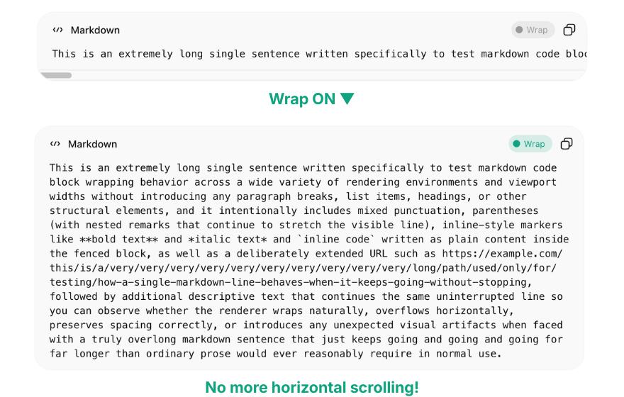

# ChatGPT Code Wrap

A browser extension for Chrome, Edge, and Firefox that adds a **Wrap** button to every code block in ChatGPT. No more horizontal scrolling to read long lines!

## Install

### Browser Extension

- **Chrome**: [Chrome Web Store](https://chrome.google.com/webstore) *(coming soon)*
- **Edge**: [Edge Add-ons](https://microsoftedge.microsoft.com/addons) *(coming soon)*
- **Firefox**: [Firefox Add-ons](https://addons.mozilla.org/en-US/firefox/addon/chatgpt-code-wrap/)

### Manual Install (Chrome / Edge / Firefox)

1. Download and unzip the [latest release](https://github.com/maoli17/chatgpt-code-wrap/releases/latest)
2. **Chrome / Edge**: Go to `chrome://extensions` (or `edge://extensions`) → enable "Developer mode" → "Load unpacked" → select the unzipped folder
3. **Firefox**: Go to `about:debugging#/runtime/this-firefox` → "Load Temporary Add-on" → select `manifest.json` from the unzipped folder

## Usage

After installing, open ChatGPT and look for the **Wrap** button in the top-right corner of any code block. Click it to toggle word wrap on/off.

## How It Works

ChatGPT uses [CodeMirror 6](https://codemirror.net/) to render code blocks. The extension overrides `white-space`, `overflow-wrap`, and `min-width` on CodeMirror's internal elements (`.cm-content`, `.cm-line`) to enable wrapping. It also handles simple code blocks (`<pre>` with `<code>` or ``) that don't use CodeMirror.

## Known Limitations

- ChatGPT may update its page structure at any time, which could cause the Wrap button to stop appearing. If this happens, please [open an issue](https://github.com/maoli17/chatgpt-code-wrap/issues).
- Long tokens (URLs, variable names) may break at arbitrary points when wrap is on. This is intentional.

## Roadmap

- [ ] Claude.ai support
- [ ] Gemini support
- [ ] Improve header bar detection for edge cases
- [ ] Dark mode fallback colors

## License

[MIT](./LICENSE)