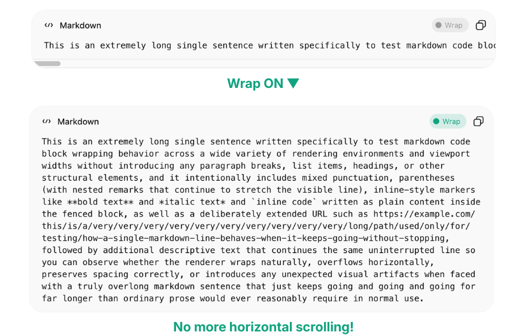

# ChatGPT Code Wrap

A lightweight browser extension for Chrome, Edge, and Firefox that adds word wrap controls to code blocks.

**Now supports ChatGPT, Claude, and Gemini.**

No more horizontal scrolling when reading long code lines.

## Supported Sites

- ChatGPT: `chatgpt.com`, `chat.openai.com`
- Claude: `claude.ai`
- Gemini: `gemini.google.com`

## Install

Install from your browser's extension store:

- [Chrome Web Store](https://chromewebstore.google.com/detail/chatgpt-code-wrap/plhjikjpniajpkfigoidcoghndkfmnkf)
- [Microsoft Edge Add-ons](https://microsoftedge.microsoft.com/addons/detail/chatgpt-code-wrap/jamhcgajmjaablfnbmgceehoolpdiajp)
- [Firefox Add-ons](https://addons.mozilla.org/en-US/firefox/addon/chatgpt-code-wrap/)

Manual install:

1. Download and unzip the [latest release](https://github.com/maoli17/chatgpt-code-wrap/releases/latest).
2. Chrome / Edge: open `chrome://extensions` or `edge://extensions`, enable **Developer mode**, click **Load unpacked**, and select the unzipped folder that contains `manifest.json`.
3. Firefox: open `about:debugging#/runtime/this-firefox`, click **Load Temporary Add-on**, and select `manifest.json` from the unzipped folder.

## Usage

Open ChatGPT, Claude, or Gemini.

Each supported code block will show a **Wrap** button in the code block header or near the top-right area of the block.

Click **Wrap** to toggle word wrap for that code block.

- Gray button: wrap is off
- Green button: wrap is on

The setting is applied per code block.

Open the extension popup to enable **Auto-wrap code blocks**. When enabled, supported code blocks wrap by default on ChatGPT, Claude, and Gemini, including newly generated code blocks.

The Auto-wrap setting is saved by your browser. You can still use the per-block **Wrap** button to temporarily override an individual code block on the current page.

## How It Works

Different AI chat platforms render code blocks with different DOM structures.

This extension detects the code block structure for each supported site and inserts a small **Wrap** toggle button.

When wrap is enabled, the extension applies CSS rules such as:

- `white-space: pre-wrap`
- `overflow-wrap: anywhere`
- `word-break: break-word`
- `overflow-x: visible`

The extension avoids inserting the button directly into the actual `<pre>` content for Claude and Gemini, so copied code is not polluted by the `Wrap` label.

The Auto-wrap preference is stored with the browser extension storage API.

It also includes a lightweight repair mechanism for streamed React / Angular updates. If the page re-renders a code block and removes the injected button, the extension can detect the missing button and add it back.

## Recent Updates

### v1.2.1

- Added support for ChatGPT's editable writing/code block container
- Added Wrap beside the native Copy action in both inline and full-screen editable code-like blocks
- Limited the new detection path to writing blocks containing `pre > code`, avoiding ordinary editable documents
- Added repair handling for ChatGPT header re-renders and editor mode changes

### v1.2.0

- Added a popup setting to auto-wrap supported code blocks by default
- Saved the Auto-wrap preference with browser extension storage
- Applied Auto-wrap changes immediately to existing code blocks on the current page
- Preserved per-block manual wrap and unwrap controls
- Improved handling for streamed and re-rendered code blocks on ChatGPT, Claude, and Gemini

### v1.1.1

- Updated popup text and automatic version display for ChatGPT, Claude, and Gemini
- Improved guards to avoid injecting Wrap in user/input areas

### v1.1.0

- Added support for Claude code blocks on `claude.ai`
- Added support for Gemini code blocks on `gemini.google.com`
- Added safer code block detection across ChatGPT, Claude, and Gemini
- Added repair logic for streamed React / Angular updates
- Preserved the ChatGPT fixes for the updated code block DOM

### v1.0.1

- Fixed compatibility with the updated ChatGPT code block DOM
- Skipped nested CodeMirror `<pre class="cm-content">` elements
- Fixed duplicate Wrap buttons on some ChatGPT code blocks
- Improved fallback button placement for plain-text code blocks

## Known Limitations

- ChatGPT, Claude, and Gemini may update their page structure at any time. If the **Wrap** button stops appearing, please [open an issue](https://github.com/maoli17/chatgpt-code-wrap/issues).

- Long tokens such as URLs, hashes, base64 strings, or very long variable names may break at arbitrary points when wrap is enabled. This is intentional.

- For plain-text code blocks without a native header, the extension may reserve a small amount of space near the top of the code block to avoid covering the text.

## Roadmap

- [x] ChatGPT support
- [x] Claude support
- [x] Gemini support
- [x] Improve header bar detection for edge cases
- [x] Improve fallback placement for plain-text code blocks
- [x] Add repair logic for streamed updates
- [x] Optional global default wrap setting
- [ ] Optional button position setting
- [ ] Additional AI chat platforms

## License

[MIT](./LICENSE)
